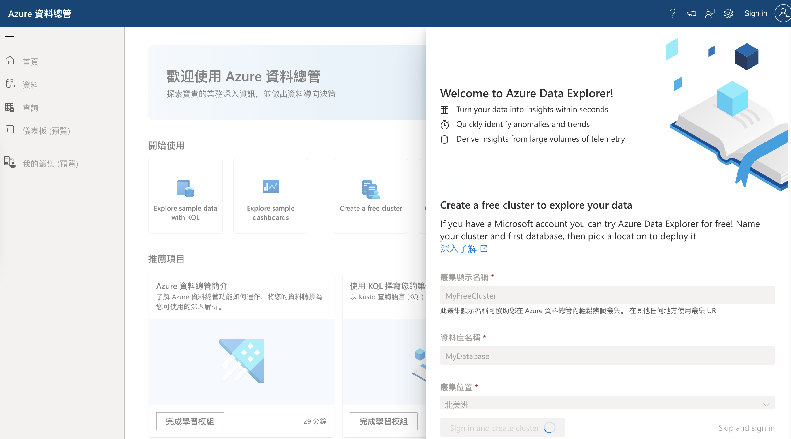
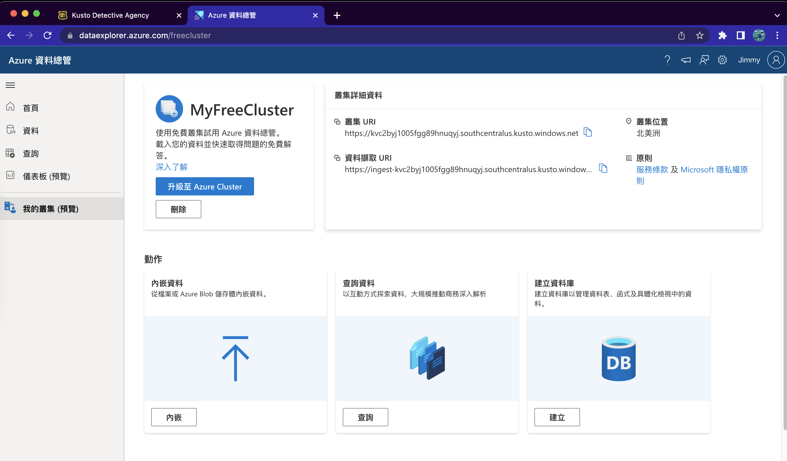
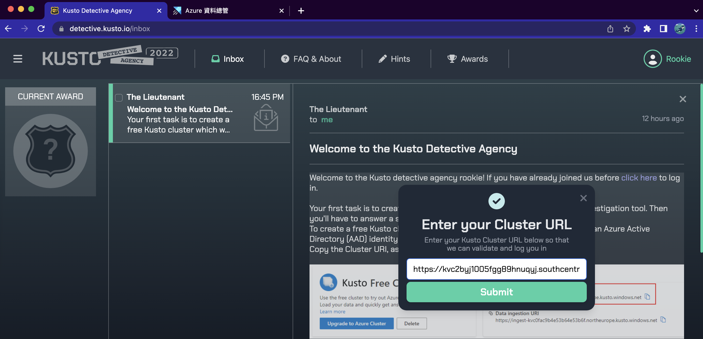
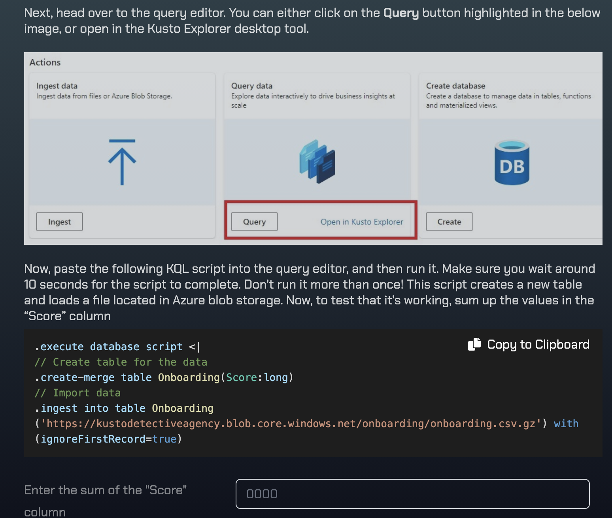
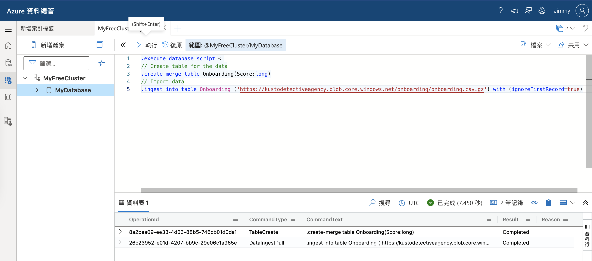
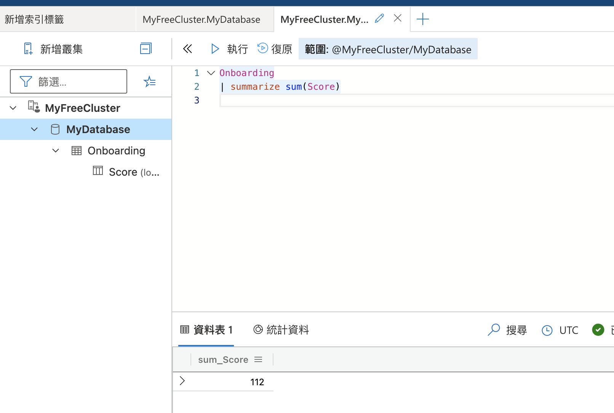
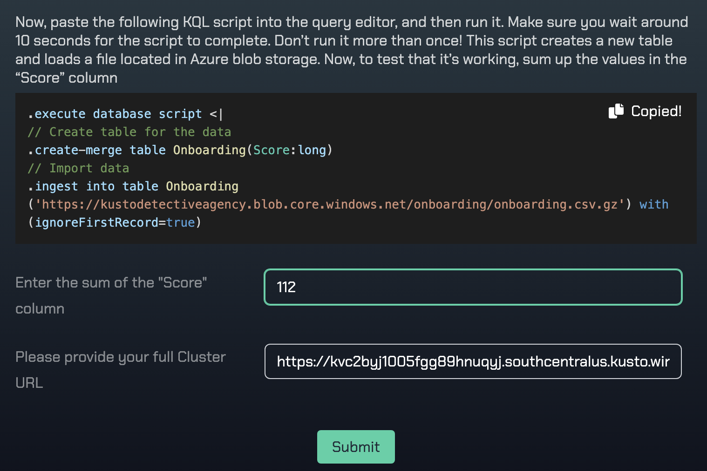
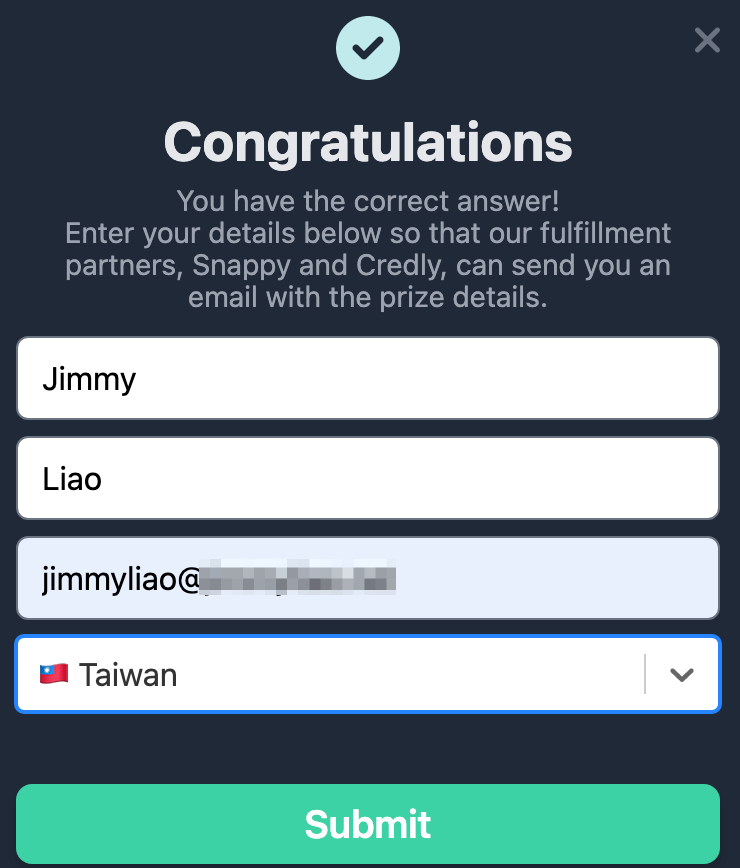
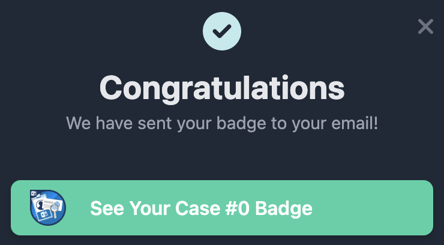
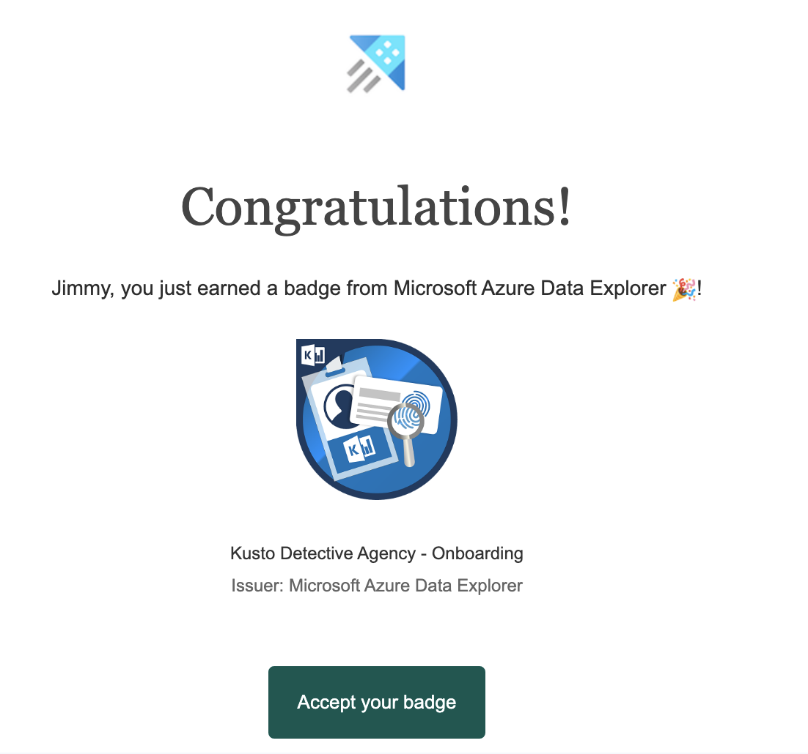

之前的案子接觸了 Azure Data Explorer 跟 SDK 開發，想說把之前理解的整理一下，發現這個有趣的 Challenge 可以釐清基本的觀念。

<!--more-->

1. 先到 https://detective.kusto.io/ ，點選 Inbox。

2. 依照指示建立 free cluster
https://dataexplorer.azure.com/publicfreecluster
    

3. 建立好 free cluster 之後會自動帶到 ADX 畫面，記得將 Cluster URI 複製，待會會填入到 Challenge

    

4. 將前一個步驟的 Cluster URI 填入
  

5. 接著依照指示打開 Query 工具，將底下 Onboarding 的 Database 建起來。
  
  

6. 先用個簡單的 KQL 找 Score 加總吧！
  

7. 回到 Challenge 畫面填入答案跟你的 free cluster URL.
  

8. 答案正確的話，會需要你的 Credly 資訊。
  
  

9. 恭喜！開始你的 Azure Data Explorer (Kusto) 挑戰吧～
  

